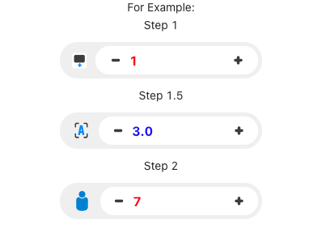

# input-numbers

> ClassFunc input component use easy!

[](https://www.npmjs.com/package/input-numbers) [](https://standardjs.com)

Link demo : https://duongdam.github.io/input-numbers/



## Install

```bash
npm install --save input-numbers

yarn add input-numbers
```

## Usage

```js
import React from "react";
import { ReactComponent as NumCalendar } from "./numMonitor.svg";
import { ReactComponent as FontIcon } from "./font.svg";
import { ReactComponent as IdentityImage } from "./hubman.svg";

import { CLFInputNumber } from "input-numbers";
import "input-numbers/dist/index.css";

const App = () => {
  const [value, setValue] = React.useState(1)

  return (
    <>
      For Example:
      <CLFInputNumber
        imgComponent={<NumCalendar/>}
        min={1}
        max={9999}
        value={value}
        callBack={(e) => {
          setValue(e)
        }}
        // autoFocus={true}
      />

      <CLFInputNumber
        imgComponent={<FontIcon/>}
        value={3}
        step={1.5}
      />

      <CLFInputNumber
        imgComponent={<IdentityImage/>}
        value={7}
        step={2}
      />

    </>
  );
};

export default App;

```

## License

MIT © [duongdam](https://github.com/duongdam)
